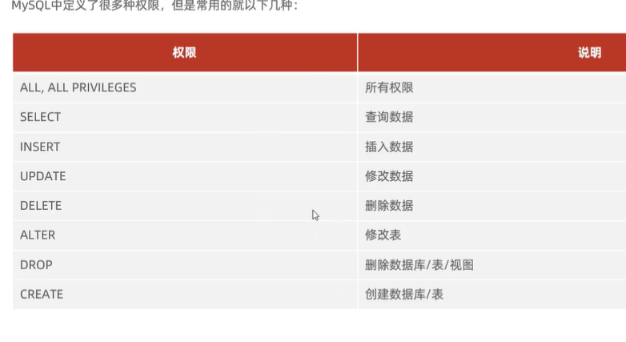
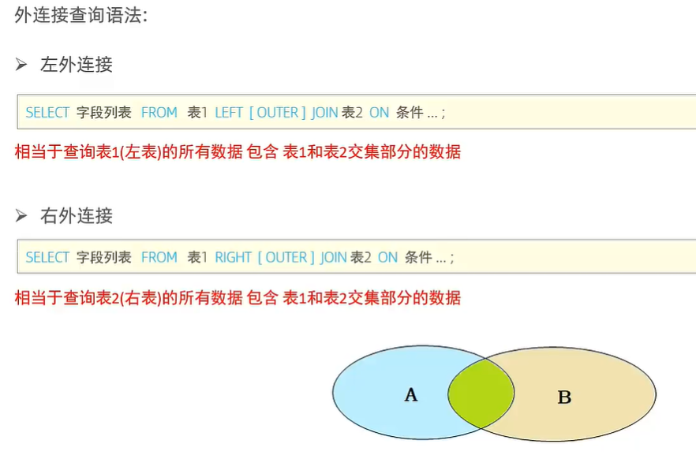

# MySql


# MySql基础篇（6个方面）


# 1. MySql概述


## 1.1 数据库相关概念


## 1.2 MySql数据库

### 1.2.1 版本


### 1.2.2 下载

官网

### 1.2.3 安装


### 1.2.4 启动和停止


### 1.2.5 客户端连接


### 1.2.5 关系型数据库


### 1.2.5 数据模型


### 1.2.6 总结


# 2. SQL语句

## 2.1 SQL语法


## 2.2 SQL分类


## 2.3 DDL（数据库对象）— Definition

> 数据库对象不单单指数据库，应该是：数据库、表、字段

### 2.3.1 DDL——数据库操作


> 注意：创建时：


> 注意： 删除时：


### 2.3.2 DDL——表操作


### 2.3.3 DDL——表结构的数据类型


#### （1）数值类型

		

#### （2）字符串类型


#### （3）日期时间类型


#### （4）案例


```mysql
create table employee (
	id int comment '序号',
    employee_id varchar(10) comment '员工工号',
    employee_name varchar(20) comment '员工姓名',
    employee_gender char(1) comment '男/女',
    employee_age tinyint unsigned comment '年龄',
    employee_number varchar(18) comment '身份证号码',
    time date comment '入职时间'
) comment'员工信息表';
```

### 2.3.4 DDL——表结构的修改与添加

#### （1）添加


#### （2）修改


#### （3）删除


### 2.3.5 DDL——总结


## 2.4 图形化界面


## 2.5 DML——Manipulation

> insert update delete


### 2.5.1 Insert


### 2.5.2  Update


### 2.5.3 Delete


### 2.5.4 总结


## 2.6 DQL——Query


### 2.6.1 DQL语法


### 2.6.2 基本查询


### 2.6.3 条件查询

`

``` mysql
select * from emp where age = 88;

select * from emp where age < 20;

select * from emp where age <= 20;

select * from emp where idcard is null;  -- is NULL 判断是不是NULL型

select * from emp where idcard is not null;

select * from emp where age != 88;      -- 不等于： <> 或者 ！=

select * from emp where age >= 15 && age <= 20; 
select * from emp where age >= 15 and age <= 20; 
select * from emp where age between 15 and 20;   -- 闭区间 [15,20]

select * from emp where gender = '女' and age < 25;

select * from emp where age = 18 || age = 20 || age = 40;
select * from emp where age = 18 or age = 20 or age = 40;
select * from emp where age in(18,20,40);   -- in中的数据：多选一

-- 查询姓名为两个字的员工（模糊查询）
select * from emp where name like '__';  -- _: 单个字符   %： 多个字符

-- 查询身份证最后一位为X的员工
select * from emp where id_card like '%X';
select * from emp where id_card like '_________________X'; -- 前17个字符是任意的


```

### 2.6.4 聚合函数——count、max、min、avg、sum

> 聚合函数：作用于某一列的！
>
> ！注： NULL值是不参与聚合函数的运算的。


``` mysql
select count(*) from emp;

select count(idcard) from emp;

select avg(age) from emp;

select max(age) from emp;

select min(age) from emp;

select sum(age) as "西安地区员工年龄之和" from emp where workaddress = '西安';

-- 所有的NULL值不参与聚合函数的运算

```

### 2.6.5 分组查询——group by

```mysql
-- 分组查询语法

select 字段（一般为聚合函数和分组字段） from 表名 [where 条件] Group By 分段字段名 [HAVING 分组之后的过滤条件]
```


> - 先where 过滤，然后group by 分组，最后用having对分组之后的结果进行过滤。
>
> - 分组之后，查询的字段一般为聚合函数和分组字段，查询其他字段没有意义的（比如查name那么只会显示第一个数据，其他符合的数据就显示了）。


``` mysql
select count(*)  from emp group by gender;  -- 分组通常和聚合函数使用

select gender, avg(age)  from emp group by gender; -- 根据性别，统计男女员工的平均年龄

select sum(*) > 3 from emp where age < 45 group by workaddress having 
```


### 2.6.6 排序查询——order by

```mysql
-- SQL 支持多字段的排序
-- ASC（ascend）：升序（默认值）， DESC（descend）： 降序
select 字段列表 from 表名 order by 字段1 排序方式1,字段2 排序方式2;
```


```mysql
-- 排序练习

select * from emp order by age asc;

select * from emp order by entrydate desc;

select * from emp order by age asc,entrydate desc;
```

### 2.6.7 分页查询——limit

```mysql
-- 语法
select 字段列表 from 表名 limit 起始索引，查询记录;
```

> 起始索引 ＝（查询页码 - 1）* 每页显示记录数；


```mysql
--  分页查询例子
select * from emp limit 0,10;

select * from emp limit 3,10;
```

### 2.6.7 巩固案例


``` mysql
select * from emp where gender = '女' and age in(20,21,22,23);

select * from emp where gender = '男' and age between 20 and 40 and name like '___';
-- 为了让SQL语句更加清晰，应该加上（）
select * from emp where gender = '男' and (age between 20 and 40) and name like '___';

select gender, count(*) as  '年龄小于60' from emp where age < 60 group by gender;

select name,age from emp where age <= 35 order by age asc,entrydate desc;

-- 应该先排序,再分页查询
select * from emp where gender = '男' and age between 20 and 40 order by age asc,entry asc limit 5 ;


```

### 2.6.8 DQL的编写和执行顺序

> 编写：select-from-where-group by-having-order by-limit
>
> 执行：from-where-group by-having-select-order by-limit


### 2.6.9 DQL总结


## 2.7 DCL——Control

> DCL：管理数据库用户，管理数据库用户对数据库的访问和权限


### 2.7.1 DCL——管理用户

> 主机名用%通配


```mysql
-- 案例
-- 创建用户 itcast , 只能够在当前主机localhost访问, 密码123456;
create user 'itcast'@'localhost' identified by '123456';

mysql -u itcast -p 123456

-- 创建用户 heima , 可以在任意主机访问该数据库, 密码123456 ;
create user 'hiema'@'%' identified by '123456';  -- %: 任意


-- 修改用户 heima 的访问密码为 1234 ;
alter user 'heima'@'%' identified with mysql_native_password by '1234';


-- 删除itcast@localhost用户
drop user 'itcast'@'locahost';

```

### 2.7.2 DCL——权限控制




``` mysql
-- 查询权限
show grants for '用户名'@'主机名'
show grants for 'root'@'localhost'

-- 授予权限
grant 权限列表 on 数据库名.表名 to '用户名'@'主机名'
-- 授予heima用户对itcast数据库的所有权限
grant all on itcast.* to 'heima'@'%'


-- 撤销权限
revoke 权限列表 on 数据名.表名 from '用户名'@'主机名'
-- 从heima用户上撤销对itcast数据库的所有权限
revoke all on itcast.* to 'heima'@'%'


```

### 2.7.3 DCL——总结


# 3. MySql内置函数


## 3.1 字符串函数

> SELECT函数（参数）
>
> 注：索引字段是不能加函数


```mysql
-- 拼接：concat
select concat('hello','mysql');

-- 转小写：lower 
select lower('HELLO MYSQL');

-- 转大写：upper
select upper('hello mysql');

-- 左填充：lpad
select lpad('01',5,'1'); -- 11101

-- 右填充：rpad
select rpad('01',5,'1'); -- 01111

-- 去字符串的首位的空格
select trim(' hello mysql ');

-- 截取  substring的索引：从1开始，是闭区间
select substring('hello mysql',1,5);


```

- 小案例


```mysql
update emp set emp.employee_id = lpad(emp.id, 5, 0) from emp;
```

## 3.2 数值函数

- 常见的数值函数


- 练习

  ``` mysql
  -- 数值函数
  -- ceil(x)
  select ceil(1.5); -- 2
  select ceil(1.1); -- 2
  
  -- floor(x)
  select floor(1.9)
  
  -- mod(x,y) -- 取模运算
  select mod()
  
  -- rand(); 返回0~1内的随机数
  
  -- round(x,y); 四舍五入
  ```


- 例子


``` mysql
-- 先随机生成一个小数，然后乘以1000000，再用round只保留整数部分，还有如果出现0.00几的情况用lpad进行补充0;
select lpad(round(rand()*1000000),6,'0');
```


## 3.3 日期函数


```mysql
-- curdate(); 日期
select curdate();

-- curtime()；时间
select curtime();

-- now()
select now();

select year(now());
select month(now());
select day(now());

-- date_add(date, interval expr type)
data_add(now(), INTERVAL 70 DAY);

-- datediff (Date1 - Date2)
select  DATEDIFF(NOW(),DATE_ADD(NOW(),INTERVAL 10 DAY)); -- -10

```


## 3.4 流程函数


````mysql
select if(true,1,2); -- 1

select ifnull('','nuk=ll'); -- ''
select ifnull(null,'123'); -- 123

-- case when then else end
-- 查询emp表的员工姓名和工作地址（北京/上海 -----》一线城市，其他----》二线城市）
select 
	name,
	(case workaddress when '北京'，then '一线城市' when'上海' then '一线城市' else '二线城市' end) as '工作地址'
from
	emp
````

- 案例

```mysql
-- 案例：统计班级每个学员的成绩，
-- >=85 优秀
-- >=60 及格
-- else，不及格

use test;
select database();
create table sorce(
	id int comment 'ID',
  name varchar(20) comment '姓名',
  math int,
  english int,
  chinese int
) comment '学员成绩表';

insert into sorce(id,name,math,english,chinese) values (1,'tom',67,78,89),(2,'Rose',23,66,90),(3,'Alex',56,78,90)


select 
	id,
	name,
	(case when math >= 85 then '优秀' when math >= 60 then '及格' else '不及格' end) 'math',
	(case when english >= 85 then '优秀' when english >= 60 then '及格' else '不及格' end) 'english',
	(case when chinese >= 85 then '优秀' when chinese >= 60 then '及格' else '不及格' end) 'chinese'
from sorce;

1	tom	    及格	 及格	 优秀
2	Rose	不及格	及格	优秀
3	Alex	不及格	及格	优秀
```

## 3.5 总结


- 解决：


# 4. 约束——针对字段

## 4.1 概述


## 4.2 约束演示


## 4.3 外键约束——保证数据的一致性和完整性


> 所以需要建立外键的关联


``` mysql
create table dept(
    id int auto_increment comment 'ID' primary key
) comment 'table of department';

create table emp(
	dept_id int comment '部门ID',
    constraint fk_emp_dept_id foreign key (dept_id) references dept(id)
) comment 'table of employee';

-- alter table emp add constraint fk_emp_dept_id foregin key(dept_id) references dept(id);


-- 添加外键
alter table emp add constraint fk_emp_dept_id foreign key(dept_id) references dept(id);

alter table epm add constraint fk_emp_dept_id foregin key (dept_id) references dept(id);
--


--  删除外键 alter table emp drop foreign key fk_emp_dept_id;

alter table emp drop foreign key fk_emp_dept_id;


```

- 删除/更新行为


```mysql
-- 添加外键并设置删除和更新行为

alter table emp add constraint fk_emp_dept_id foregin key (dept_id) references dept(id) on update restrict on delete no action;
```

## 4.4 总结

>自增 在每个数据库的表示形式不一样
>
>mysql:  字段上用 Auto_Increment
>
>Orcale：使用对象Sequence来实现自增


# 5. 多表查询——DQL

## 5.1 多表关系


### 5.1.1  一对多（多对一）

> 案例：员工和部门
>
> 实现： 在多的一方建立外键，指向一的一方的主键


### 5.1.2 多对多

> 案例：学生和课程
>
> 实现：建立中间表，中间表至少包括两个外键，分别关联两方主键
>
> 注意：student学生表要和中间表的studentid来建立外键，course课程表要和中间表的courseid                                   
>
> ​           来建立外键。


```mysql
-------------------------------- 多表关系 演示 -----------------------------------------

-- 多对多 ----------------
create table student(
    id int auto_increment primary key comment '主键ID',
    name varchar(10) comment '姓名',
    no varchar(10) comment '学号'
) comment '学生表';
insert into student values (null, '黛绮丝', '2000100101'),(null, '谢逊', '2000100102'),(null, '殷天正', '2000100103'),(null, '韦一笑', '2000100104');


create table course(
    id int auto_increment primary key comment '主键ID',
    name varchar(10) comment '课程名称'
) comment '课程表';
insert into course values (null, 'Java'), (null, 'PHP'), (null , 'MySQL') , (null, 'Hadoop');


create table student_course(
    id int auto_increment comment '主键' primary key,
    studentid int not null comment '学生ID',
    courseid  int not null comment '课程ID',
    constraint fk_courseid foreign key (courseid) references course (id),
    constraint fk_studentid foreign key (studentid) references student (id)
)comment '学生课程中间表';

insert into student_course values (null,1,1),(null,1,2),(null,1,3),(null,2,2),(null,2,3),(null,3,4);

```


### 5.1.3 一对一

> 案例： 用户  与 用户详情的关系
>
> 关系：一对一关系，多用于单表的拆分


> 一张为　基本信息的表，另外一张为　其他的详情字段，进而提高操作效率


> 将表拆分之后，应该考虑两张表的对应情况
>
> 实现：在任意的一方加入外键，关联另外一方的主键，并设置外键为唯一的(unique)，保证了一条记录对应一个用户的关系，即一对一的关系

```mysql
-- --------------------------------- 一对一 ---------------------------
create table tb_user(
    id int auto_increment primary key comment '主键ID',
    name varchar(10) comment '姓名',
    age int comment '年龄',
    gender char(1) comment '1: 男 , 2: 女',
    phone char(11) comment '手机号'
) comment '用户基本信息表';

create table tb_user_edu(
    id int auto_increment primary key comment '主键ID',
    degree varchar(20) comment '学历',
    major varchar(50) comment '专业',
    primaryschool varchar(50) comment '小学',
    middleschool varchar(50) comment '中学',
    university varchar(50) comment '大学',
    userid int unique comment '用户ID',
    constraint fk_userid foreign key (userid) references tb_user(id)
) comment '用户教育信息表';


insert into tb_user(id, name, age, gender, phone) values
        (null,'黄渤',45,'1','18800001111'),
        (null,'冰冰',35,'2','18800002222'),
        (null,'码云',55,'1','18800008888'),
        (null,'李彦宏',50,'1','18800009999');

insert into tb_user_edu(id, degree, major, primaryschool, middleschool, university, userid) values
        (null,'本科','舞蹈','静安区第一小学','静安区第一中学','北京舞蹈学院',1),
        (null,'硕士','表演','朝阳区第一小学','朝阳区第一中学','北京电影学院',2),
        (null,'本科','英语','杭州市第一小学','杭州市第一中学','杭州师范大学',3),
        (null,'本科','应用数学','阳泉第一小学','阳泉区第一中学','清华大学',4);


```


## 5.2 多表查询概述


```mysql
-- 单表查询
select * from emp;

-- 多表查询
select * from emp,dept; -- 出现笛卡尔积现象（两张表的所有情况的组合）

```


​	消除无用的笛卡尔积后：


```mysql
-- 消除无用的笛卡尔积后的sql查询：

select * from emp,dept where emp.dept.id = dept.id;
```


## 5.3 内连接——交集


```mysql
-- 查询年龄小于30岁的员工的姓名、年龄、职位、部门信息（隐式内连接）
select emp.name,dept.name from emp,dept where emp.dept_id = dept.id;

-- 使用别名,值得注意的是L使用当数据表名用别名后，再不能使用数据表名，这是因为SQL的执行顺序的butong 
select e.name,d.name from emp as e, dept as d where e.dept_id = d.id;

-- 查询年龄小于30岁的员工的姓名、年龄、职位、部门信息（显式内连接）
select emp.name,dept.name from emp inner join dept on emp.dept_id = dept.id;
```

## 5.4 外连接

- 左外链接：左表的所有数据＋左右表的交集数据—— 表1 left outer join 表2 on
- 右外链接：右表的所有数据＋左右表的交集数据—— 表1 right outer join 表2 on



```mysql
-- 查询emp表的所有数据, 和对应的部门信息(左外连接)
select e.*,d.name from emp as e left outer join dept as d on e.dept_id = d.id;

-- 查询dept表的所有数据, 和对应的员工信息(右外连接)
select d.*,e.name from dept as d right outer join emp as e on d.id = e,dept_id;

-- 等价于
select d.*,e.name from dept as d left outer join emp e on d.id =e.dept_id
```


## 5.5 自连接 ——自己连接自己查询

> 自连接查询时： 必须要起别名


> 分析之后，理解成两张独立的表。


```mysql
-- 自连接
-- 1. 查询员工 及其 所属领导的名字（内连接）
-- 表结构: emp
select a.name as 员工, b.name as 领导 from emp as a,emp as b where a.managerid = b.id;

 select a.name as 员工,b.name as 员工领导 from emp as a inner join emp as b on a.managerid = b.id;


-- 2. 查询所有员工 emp 及其领导的名字 emp , 如果员工没有领导, 也需要查询出来（左外连接:左表的所有数据和左右表的交集）
-- 表结构: emp a , emp b

select a.name as 员工 , b.name as 领导 from emp as a left outer join emp as b on a.managerid = b.id;

```

## 5.6 联合查询——union,union all

>union all：并集
>
>union: 交集（去除重复）
>
>注意： 查询的多张表的列数必须相同，而且字段类型也要保持一致


```mysql
-- union all , union
-- 1. 将薪资低于 5000 的员工 , 和 年龄大于 50 岁的员工全部查询出来.
select * from emp where salary < 5000　
union all 								-- union all 直接取并集
select * from emp where age > 50;

select * from emp where salary < 5000　
union 								-- union      取交集
select * from emp where age > 50;

```

## 5.7 子查询 


### 5.7.1 标量子查询——返回单个值


```mysql
-- 标量子查询
-- 1. 查询 "销售部" 的所有员工信息
-- a. 查询 "销售部" 部门ID
select id from dept where name = '销售部';

-- b. 根据销售部部门ID, 查询员工信息
select * from emp where dept_id = (select id from dept where name = '销售部');


-- 2. 查询在 "方东白" 入职之后的员工信息

select * from emp where entrydate > (select entrydate from emp where name = '方东白');

```

### 5.7.2 列子查询——多行（一列）


```mysql
-- 列子查询
-- 1. 查询 "销售部" 和 "市场部" 的所有员工信息
-- a. 查询 "销售部" 和 "市场部" 的部门ID
select id from dept where name = '销售部' or name = '市场部';
-- b. 根据部门ID, 查询员工信息
select * from emp wher dept_id in (2,4);

-- 合并之后
select * from emp wher dept_id in (select id from dept where name = '销售部' or name = '市场部';);


-- 2. 查询比 财务部 所有人工资都高的员工信息
-- a. 条件：查询所有 财务部 人员工资
select salary from emp where dept_id in (select id from dept where name = '财务部');

-- b. 比 财务部 所有人工资都高的员工信息
select * from emp where salary > all(select salary from emp where dept_id in (select id from dept where name = '财务部'));

select * from emp where salary > (select max(salary) from emp where dept_id in (select id from dept where name = '财务部'));


-- 3. 查询比研发部其中任意一人工资高的员工信息
-- a. 查询研发部所有人工资
select salary from emp where dept_id in (select id from dept where name = '研发部');

-- b. 比研发部其中任意一人工资高的员工信息
select * from emp where salary > any(select salary from emp where dept_id in (select id from dept where name = '研发部'));

select * from emp where salary > (select min(salary) from emp where dept_id in (select id from dept where name = '研发部'));
```

### 5.7.3 行子查询——一行（多列）

> 行子查询就是使用了行向量

```mysql
-- 行子查询
-- 1. 查询与 "张无忌" 的薪资及直属领导相同的员工信息 ;
-- a. 查询 "张无忌" 的薪资及直属领导
select salary, managerid from emp where name = '张无忌';

-- b. 查询与 "张无忌" 的薪资及直属领导相同的员工信息 ;
select * from emp where (salary,managerid) = (select salary, managerid from emp where name = '张无忌');

```


### 5.7.3 表子查询——表（多行多列）


```mysql
-- 表子查询
-- 1. 查询与 "鹿杖客" , "宋远桥" 的职位和薪资相同的员工信息
-- a. 查询 "鹿杖客" , "宋远桥" 的职位和薪资
select job,salary from emp where name = '鹿杖客' or name = '宋远桥';
-- b. 查询与 "鹿杖客" , "宋远桥" 的职位和薪资相同的员工信息
select * from emp where (job,salary) in (select job,salary from emp where name = '鹿杖客' or name = '宋远桥');


-- 2. 查询入职日期是 "2006-01-01" 之后的员工信息 , 及其部门信息
-- a. 入职日期是 "2006-01-01" 之后的员工信息
select * from emp where entrydate > '2006-01-01';
-- b. 查询这部分员工, 对应的部门信息;
select e.*,d.* from (Select * from emp where entrydate > '2006-01-01') as e left outer join dept d on  e.dept_id = d.id;

```


## 5.8 多表查询案例

```mysql
-- ---------------------------------------> 多表查询案例 <----------------------------------
create table salgrade(
    grade int,
    losal int,
    hisal int
) comment '薪资等级表';

insert into salgrade values (1,0,3000);
insert into salgrade values (2,3001,5000);
insert into salgrade values (3,5001,8000);
insert into salgrade values (4,8001,10000);
insert into salgrade values (5,10001,15000);
insert into salgrade values (6,15001,20000);
insert into salgrade values (7,20001,25000);
insert into salgrade values (8,25001,30000);


-- 1. 查询员工的姓名、年龄、职位、部门信息 （隐式内连接）
-- 表: emp , dept
-- 连接条件: emp.dept_id = dept.id

select e.name , e.age , e.job , d.name from emp e , dept d where e.dept_id = d.id;


-- 2. 查询年龄小于30岁的员工的姓名、年龄、职位、部门信息（显式内连接）
-- 表: emp , dept
-- 连接条件: emp.dept_id = dept.id

select e.name , e.age , e.job , d.name from emp e inner join dept d on e.dept_id = d.id where e.age < 30;

-- 条件判断用and
select e.name,e.age,e.job,d.name from emp e inner join dept d on e.dept_id = d.id and e.age < 30;

-- 条件判断用where
select e.name,e.age,e.job,d.name from emp e inner join dept d on e.dept_id = d.id where e.age < 30;


-- 3. 查询拥有员工的部门ID、部门名称
-- 表: emp , dept
-- 连接条件: emp.dept_id = dept.id

select distinct d.id , d.name from emp e , dept d where e.dept_id = d.id;


-- 4. 查询所有年龄大于40岁的员工, 及其归属的部门名称; 如果员工没有分配部门, 也需要展示出来
-- 表: emp , dept
-- 连接条件: emp.dept_id = dept.id
-- 外连接

select e.*, d.name from emp e left join dept d on e.dept_id = d.id where e.age > 40 ;


-- 5. 查询所有员工的工资等级
-- 表: emp , salgrade
-- 连接条件 : emp.salary >= salgrade.losal and emp.salary <= salgrade.hisal

select e.* , s.grade , s.losal, s.hisal from emp e , salgrade s where e.salary >= s.losal and e.salary <= s.hisal;

select e.* , s.grade , s.losal, s.hisal from emp e , salgrade s where e.salary between s.losal and s.hisal;


-- 6. 查询 "研发部" 所有员工的信息及 工资等级
-- 表: emp , salgrade , dept
-- 连接条件 : emp.salary between salgrade.losal and salgrade.hisal , emp.dept_id = dept.id
-- 查询条件 : dept.name = '研发部'

select e.* , s.grade from emp e , dept d , salgrade s where e.dept_id = d.id and ( e.salary between s.losal and s.hisal ) and d.name = '研发部';


-- 7. 查询 "研发部" 员工的平均工资
-- 表: emp , dept
-- 连接条件 :  emp.dept_id = dept.id

select avg(e.salary) from emp e, dept d where e.dept_id = d.id and d.name = '研发部';


-- 8. 查询工资比 "灭绝" 高的员工信息。
-- a. 查询 "灭绝" 的薪资
select salary from emp where name = '灭绝';

-- b. 查询比她工资高的员工数据
select * from emp where salary > ( select salary from emp where name = '灭绝' );


-- 9. 查询比平均薪资高的员工信息
-- a. 查询员工的平均薪资
select avg(salary) from emp;

-- b. 查询比平均薪资高的员工信息
select * from emp where salary > ( select avg(salary) from emp );


-- 10. 查询低于本部门平均工资的员工信息

-- a. 查询指定部门平均薪资  1
select avg(e1.salary) from emp e1 where e1.dept_id = 1;
select avg(e1.salary) from emp e1 where e1.dept_id = 2;

-- b. 查询低于本部门平均工资的员工信息
select * from emp e2 where e2.salary < ( select avg(e1.salary) from emp e1 where e1.dept_id = e2.dept_id );


-- 11. 查询所有的部门信息, 并统计部门的员工人数
select d.id, d.name , ( select count(*) from emp e where e.dept_id = d.id ) '人数' from dept d;

select count(*) from emp where dept_id = 1;


-- 12. 查询所有学生的选课情况, 展示出学生名称, 学号, 课程名称
-- 表: student , course , student_course
-- 连接条件: student.id = student_course.studentid , course.id = student_course.courseid

select s.name , s.no , c.name from student s , student_course sc , course c where s.id = sc.studentid and sc.courseid = c.id ;
```

## 5.9 总结


# 6. 事务

## 6.1 事务简介

## 6.2 事务操作


```mysql
-- 恢复数据
update account set money = 2000 where name = '张三' or name = '李四';


select @@autocommit;

set @@autocommit = 0; -- 设置为手动提交

-- 转账操作 (张三给李四转账1000)
-- 1. 查询张三账户余额
select * from account where name = '张三';

-- 2. 将张三账户余额-1000
update account set money = money - 1000 where name = '张三';

程序执行报错 ...

-- 3. 将李四账户余额+1000
update account set money = money + 1000 where name = '李四';


-- 提交事务
commit;

-- 回滚事务
rollback ;


-- 方式二 start transaction ;
-- 转账操作 (张三给李四转账1000)
start transaction ;

-- 1. 查询张三账户余额
select * from account where name = '张三';

-- 2. 将张三账户余额-1000
update account set money = money - 1000 where name = '张三';

程序执行报错 ...

-- 3. 将李四账户余额+1000
update account set money = money + 1000 where name = '李四';


-- 提交事务
commit;

-- 回滚事务
rollback;


```

## 6.3 事务的四大特性


## 6.4 并发事务问题

> 事务A修改了数据库的数据（未提交）
>
> 然后事务B查询数据，就会查到事务A修改过但未提交的数据


> 事务A执行查询过程中
>
> 事务A查询到了第一次结果
>
> 事务A执行查询过程中，事务B提交了对数据的修改
>
> 事务A查询到了第二结果
>
>  这样就会出现不同的数据结果。导致不可重复读。


> 事务A（开启事务）查询要插入的数据，发现没有
>
> 事务B（开启事务）插入事务A想插入的数据，并且提交事务
>
> 事务A 将要插入的数据插入时，发现报错，这个数据已经存在了，
>
> 然后再次查询这个数据，数据库里根本查询，这就出现了所谓的幻读。
>
> ——幻读：查没有数据，插入时这个数据已经存在


## 6.5 事务隔离级别

> mysql默认隔离级别为：repeatable read;
>
> orcale默认隔离级别为：read committed;


## 6.6 总结


# 7. 总结


招商租赁，公司租了给员工做


