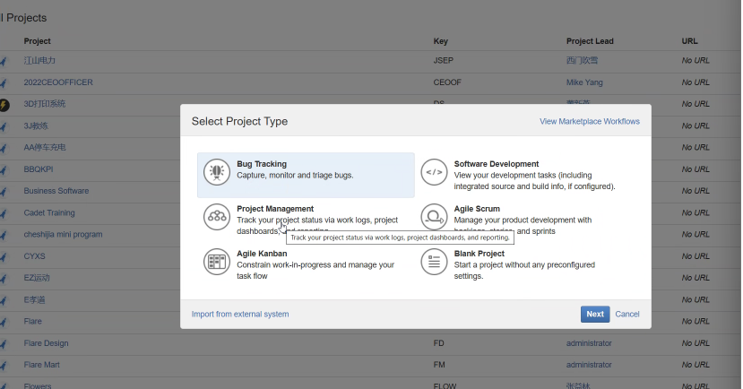
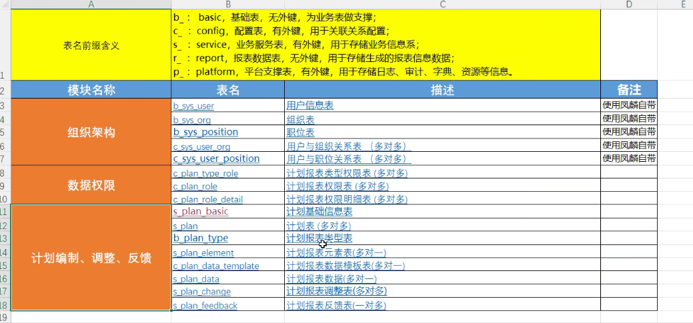
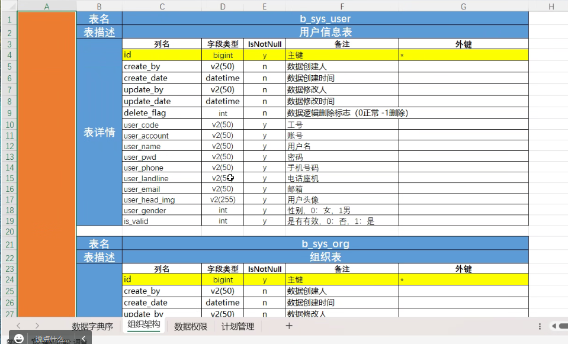
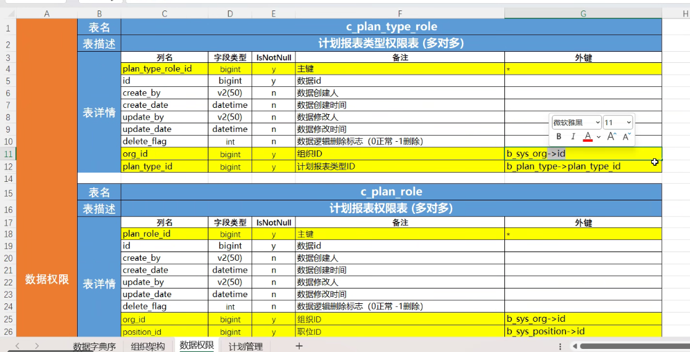
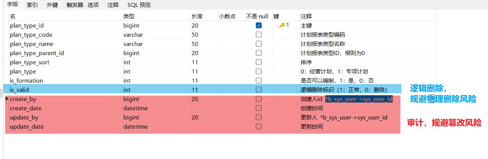
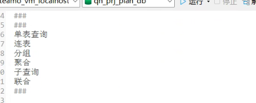
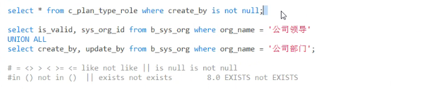
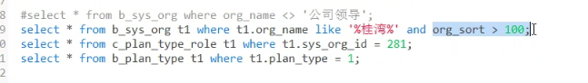
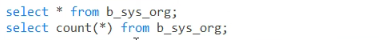

# 六、表彰和不良行为处理

- 表彰奖励、奖励形式
- 不良行为处理

> 项目追踪、管理

工作中：是协同工作，减少信息差，提高效率。

- 解释型语言和编译型语言的区别（至少掌握一门解释型语言）

# 网络基础

# SOP（Standard Operating Procedure）标准作业程序（4.7）

深圳前海管理局：各种公司

ISO标准是国际标准化组织（ISO）制定的标准，这些标准旨在为组织、企业和个人提供指导，帮助他们遵循最佳实践，提高产品和服务质量，提高效率，降低成本，保护环境，促进可持续发展等。ISO标准适用于各种领域，如质量管理、环境管理、信息安全管理、食品安全管理、能源管理、社会责任等。

plan 是动态（要考风险pmp，pmi，pmbok）

项目：时间+计划+成本

搞服务——盘子——服务员

人sop = 谦虚低调，每人行，必有我师焉。

京东——900多套系统，高并发，区域分划，种类分类等。

内部资料要保密

合同签订（所有的手续）后再开始做，必须首付款的百分之30。

客户的要求就是对自己的要求

多问人，多思考

# 4.7 p.m

## 数据库DDL、DML报表

## 数据库设计(前缀、各个模块)

## 文档规范

## 查询

## 

> 8.0 之后都可以用，in 和 not in 都进行优化了
>
>  
>
> - exist 和 not exist的使用

> 应该先使用  过滤数据最多的条件再依次后之(大条件最前面，过滤主标)

> 聚合函数中的count(*) 效率最高

>union：去重复
>
>union all：并集

> 多表查询

## SQL语句的执行

14、 说说在 MySQL 中一条查询 SQL 是如何执行的？
比如下面这条SQL语句：

1. **取得链接**，使用使用到 MySQL 中的连接器。
select name from t_user where id=1

2. **查询缓存**，key 为 SQL 语句，value 为查询结果，如果查到就直接返回。不建议使用次缓存，
  **在 MySQL 8.0 版本已经将查询缓存删除，也就是说 MySQL 8.0 版本后不存在此功能。**

3. **分析器**，分为词法分析和语法分析。此阶段**只是做一些 SQL 解析，语法校验**。所以一般语法错
  误在此阶段。**（What，分析器是明白做什么）**

4. **优化器**，是在表里有多个索引的时候，决定**使用哪个索引**；或者一个语句中存在多表关联的时
  候（join），决定**各个表的连接顺序**。**（How，优化器是应该如何做是最优的）**

5. **执行器**，通过分析器让 SQL 知道你要干啥，通过优化器知道该怎么做，于是开始执行语句。

  执行语句的时候还要判断是否具备此权限，没有权限就直接返回提示没有权限的错误；有权限则
  打开表，**根据表的引擎定义，去使用这个引擎提供的接口**，获取这个表的第一行，判断 id 是都
  等于 1。如果是，直接返回；如果不是继续调用引擎接口去下一行，重复相同的判断，直到取
  到这个表的最后一行，最后返回。

