# 移动端前台实现

# 3.购物车

## （1）需求分析


## （2）数据模型


> 套餐是没有口味的！只有菜品有。

## （3）代码开发——梳理交互过程（三个）

## 开发购物车，就是在服务端编写代码去处理前端页面发送的这3次请求即可

- 点击 `加入购物车` 或者 `+`按钮，页面发送ajax请求，请求服务端，将菜品或者套餐添加到购物车中

```java
/**
     * 添加购物车
     * @param shoppingCart
     * @return
     */
    @PostMapping("/add")
    public R<ShoppingCart> add(@RequestBody ShoppingCart shoppingCart) {
        log.info("购物车数据：{}",shoppingCart.toString());
        // 从ThreadLocal中获取用户id，指定当前那个用户的购物车数据
        Long currentId = BaseContext.getCurrentId();
        shoppingCart.setUserId(currentId);

        Long dishId = shoppingCart.getDishId();

        // 构造条件构造器
        LambdaQueryWrapper<ShoppingCart> queryWrapper = new LambdaQueryWrapper<>();
        // 添加条件
        queryWrapper.eq(ShoppingCart::getUserId,currentId);

        if (dishId != null) {
            // 添加到购物车的是菜品
            queryWrapper.eq(ShoppingCart::getDishId,dishId);
        } else {
            // 添加到购物车的是套餐
            queryWrapper.eq(ShoppingCart::getSetmealId,shoppingCart.getSetmealId());
        }

        // 查询当前菜品或者是套餐是否在购物车中
        // SqlL select * from shopping_cart where use_id = ? and dish_id/setmeal_id = ?
        ShoppingCart cartServiceOne = shoppingCartService.getOne(queryWrapper);
        if (cartServiceOne !=  null) {
            // 如果已经存在，就在原来的数量基础上加1
            Integer number = cartServiceOne.getNumber();
            cartServiceOne.setNumber(number + 1);
            shoppingCartService.updateById(cartServiceOne);
        } else {
            // 如果不存在，就添加到购物车，
            // 因为传过来的json数据的number属性是没有值的，所以数量默认是1
            shoppingCart.setNumber(1);
            shoppingCart.setCreateTime(LocalDateTime.now());
            shoppingCartService.save(shoppingCart);
            cartServiceOne = shoppingCart;
        }

        // 将数据返回给前端购物车中
        return R.success(cartServiceOne);
    }
```

- 点击`购物车图标` ，页面ajax请求，请求服务端查询购物车中的菜品和套餐

```java
    /**
     * 查看购物车
     * @return
     */
    @GetMapping("/list")
    public R<List<ShoppingCart>> list() {
        log.info("查看购物车。。。");

        // 获取当前ThreadLocal的值
        Long currentId = BaseContext.getCurrentId();


        // 构造mybatis-plus的一个条件器
        LambdaQueryWrapper<ShoppingCart> queryWrapper = new LambdaQueryWrapper<>();
        
        // 添加条件
        queryWrapper.eq(ShoppingCart::getUserId,currentId);

        // 添加排序条件：后加进来的菜品是最上面来展示的，所以按照时间的升序来排
        queryWrapper.orderByAsc(ShoppingCart::getCreateTime);

        // 执行条件器
        // SQL: select * form shopping_cart where user_id = ? order by create_time ASC
        List<ShoppingCart> list = shoppingCartService.list(queryWrapper);

        return R.success(list);
    }
```

- 点击`清空购物车按钮`，页面发送ajax请求，请求服务端来执行清空购物车操作

```java
	/**
     * 清空购物车
     * @return
     */
	@DeleteMapping("/clean")
    public R<String> clean() {
        LambdaQueryWrapper<ShoppingCart> queryWrapper = new LambdaQueryWrapper<>();
        queryWrapper.eq(ShoppingCart::getUserId,BaseContext.getCurrentId());
        // 执行条件器
        // SQL: delete from shopping_cart where user_id = ?
        shoppingCartService.remove(queryWrapper);
        return R.success("清空成功");
    }
```

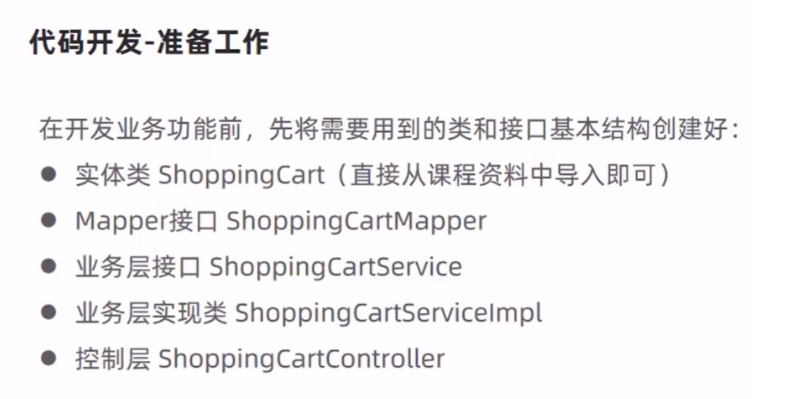


## （4）功能测试


# 用户下单

### （1）需求分析


## （2）数据模型

> 用户下单业务，对应的数据表为orders表和order_detail表

- orders表：订单表

  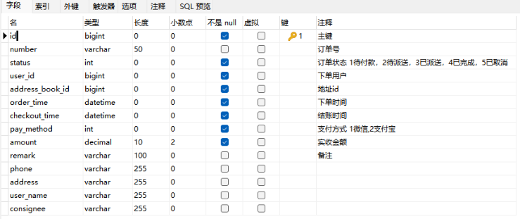

- order_detail表：订单明细表


## （3.1）代码开发——梳理交互过程（三个，只需要写一个就行）

## 只需要开发`用户下单`的功能

- 在购物车中点击 `去结算` 按钮，页面跳转到 订单确认页面
- 在确认订单页面，发送ajax请求，请求服务端获取当前登录用户的默认地址
- 在确认订单页面，发送ajax请求，请求服务端获取当前登录用户的购物车数据
- 在订单确认页面中点击 `去支付` 按钮，发送ajax请求，请求服务端完成下单操作

```java
@Slf4j
@Service
public class OrderServiceImpl extends ServiceImpl<OrderMapper, Orders> implements OrderService {
    @Autowired
    private ShoppingCartService shoppingCartService;

    @Autowired
    private UserService userService;

    @Autowired
    private AddressBookService addressBookService;

    @Autowired
    private OrderDetailService orderDetailService;

    /**
     * 用户下单
     * @param orders
     */
    @Override
    public void submit(Orders orders) {

        // 1.获得当前用户的id
        Long currentId = BaseContext.getCurrentId();

        // 2.查询当前用户的购物车数据
        LambdaQueryWrapper<ShoppingCart> queryWrapper = new LambdaQueryWrapper<>();
        queryWrapper.eq(ShoppingCart::getUserId,currentId);
        List<ShoppingCart> shoppingCarts = shoppingCartService.list(queryWrapper);
        if (shoppingCarts == null || shoppingCarts.size() == 0) {
            throw new CustomException("购物车为空，不能下单");
        }

        // 3.查询用户数据
        User user = userService.getById(currentId);

        // 4.查询地址数据
        Long addressBookId = orders.getAddressBookId();
        AddressBook addressBook = addressBookService.getById(addressBookId);
        if (addressBook == null) {
            throw new CustomException("用户地址信息有误，不能下单");
        }

        // 5.向订单表插入数据，一条数据
        long orderId = IdWorker.getId(); //订单号
        orders.setNumber(String.valueOf(orderId));
        orders.setOrderTime(LocalDateTime.now());
        orders.setCheckoutTime(LocalDateTime.now());
        orders.setStatus(2);

        // 6.AtomicInteger保证了Java并发机制的原子性
        AtomicInteger amount = new AtomicInteger(0);
        // 7.算出总金额
        List<OrderDetail> orderDetails = shoppingCarts.stream().map((item) -> {
            OrderDetail orderDetail = new OrderDetail();
            orderDetail.setName(item.getName());
            orderDetail.setImage(item.getImage());
            orderDetail.setOrderId(orderId);
            orderDetail.setSetmealId(item.getSetmealId());
            orderDetail.setDishId(item.getDishId());
            orderDetail.setDishFlavor(item.getDishFlavor());
            orderDetail.setNumber(item.getNumber());
            orderDetail.setAmount(item.getAmount());
            // AtomicInteger的addAndGet()方法，先加在获取值
            amount.addAndGet(item.getAmount().multiply(new BigDecimal(item.getNumber())).intValue());
            return orderDetail;
        }).collect(Collectors.toList());
        orders.setAmount(new BigDecimal(amount.get()));

        orders.setUserId(currentId);
        orders.setUserName(user.getName());
        orders.setConsignee(addressBook.getConsignee()); // 设置收货人
        orders.setPhone(addressBook.getPhone());
        orders.setAddress(
                (addressBook.getProvinceName() == null ? "": addressBook.getProvinceName())
                +(addressBook.getCityName() == null ? "" : addressBook.getCityName())
                +(addressBook.getDistrictName() == null ? "" : addressBook.getDistrictName())
                +(addressBook.getDetail() == null ? "" : addressBook.getDetail())
        );
        this.save(orders);

        // 8.向订单明细表插入数据，多条数据
        orderDetailService.saveBatch(orderDetails);

        // 9.清空购物车数据
        shoppingCartService.remove(queryWrapper);

    }
}
```


## （3.2）代码开发——准备工作

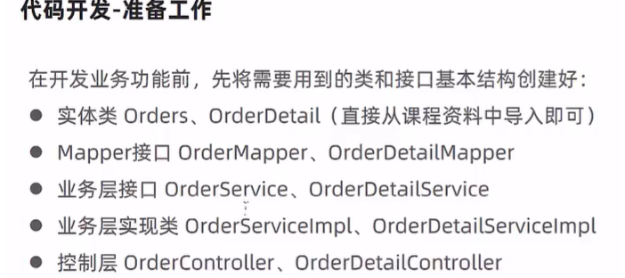

# GIT篇


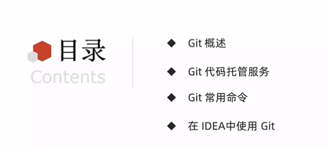.

# 1.Git概述（分布式版本控制工具）

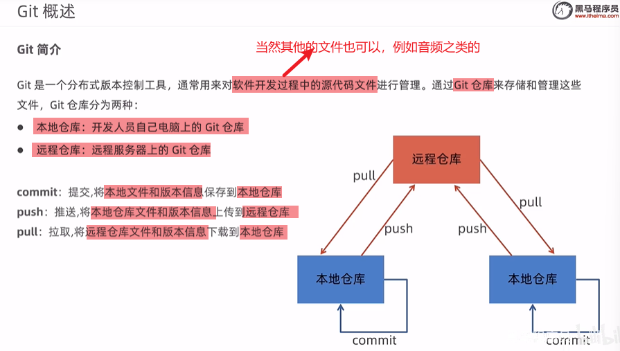

# 2.Git代码托管服务

## （1）常用的托管平台

- gitHub
- gitee(码云)
- GitLab
- BitBucket

## （2）使用码云来托管服务

1.注册码云账号

2.登录码云

3.创建远程仓库

4.邀请其他用户来成为仓库成员

# 3.Git常用命令

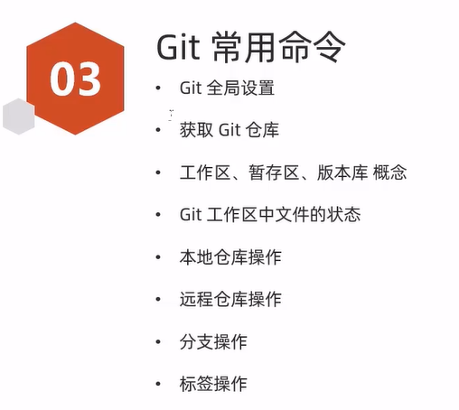


## （1）Git全局设置

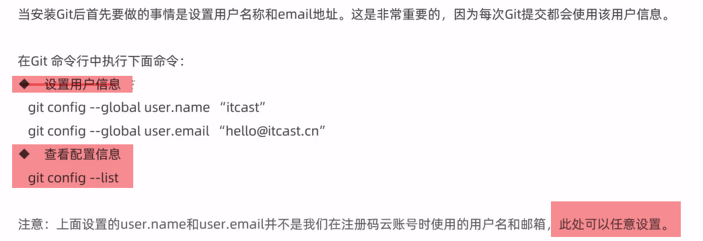


## （2）获取Git仓库


### 在本地仓库初始化Git仓库——git init

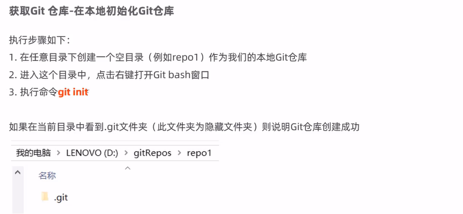


### 克隆远程仓库创建——git clone(ssh)

## （3）工作区、暂存区、版本库 概念

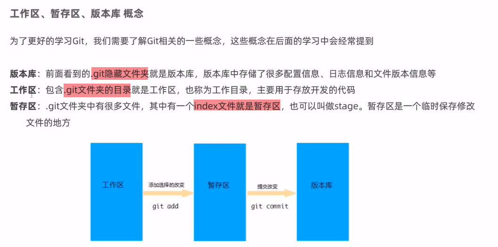


## （4）Git工作区（.git文件夹）中文件的状态

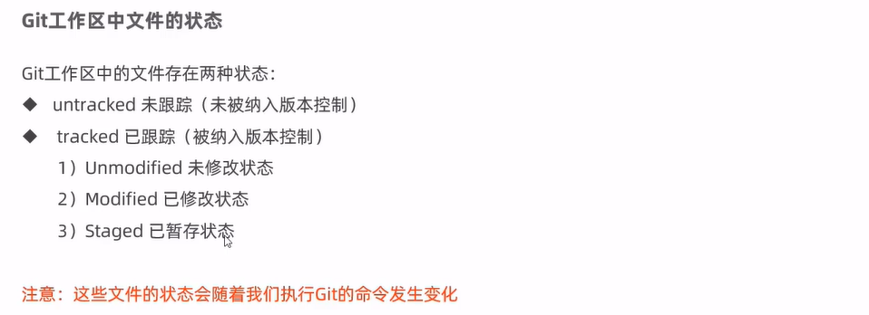

## （5）本地仓库的操作

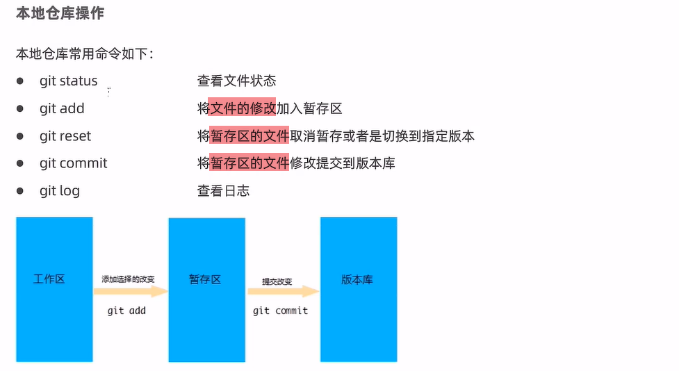


## （6）远程仓库操作

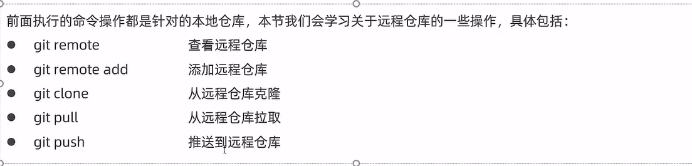

### 查看已经配置的远程仓库服务器——git remote


### 添加远程仓库——git remote add shortname  url


### 克隆远程仓库到本地——git clone url


### 推送远程仓库——git push


### 从远程仓库拉取——git pull short-name branch-name


## （7）分支操作


> shortname：远程仓库的名称		name：分支名称

### 查看分支——git branch


### 创建分支——git branch name


### 切换分支——git checkout name


### 合并分支 ——git merge name


### 合并问题——两个不同分支的下 相同的文件，但是内容不同名，需要以下操作

>git add filename

````c
16644@DESKTOP-S8E7L92 MINGW64 /d/1自学/GIT_heima/repo2 (master|MERGING)
$ git  commit -m "手动解决文件合并问题" b1.txt
fatal: cannot do a partial commit during a merge.  //出现这个错误  直接后面加-i

16644@DESKTOP-S8E7L92 MINGW64 /d/1自学/GIT_heima/repo2 (master|MERGING)
$ git  commit -m "手动解决文件合并问题" b1.txt -i  
[master 342d2df] 手动解决文件合并问题

````


## （8）标签操作

>标签：记录每个特定时间点的状态——每张照片


>shortName：是远程仓库的别名
>
>name：是标签名


### 查看已有标签——git tag


### 创建标签——git tag  name


### 推送标签到远程仓库——git push shortName name


### 检出标签——git checkout -b branch name

> 也就是用一个分支和一个标签进行绑定


# 4.在IDEA中使用Git


## （1）在IDEA中配置Git


## （2）获取Git仓库


## （3）本地仓库操作


## （4）远程仓库操作


## （5）分支操作


# Linux

# 学习目标


# 1. Linux简介


> 特点：免费、开源、多用户、多任务


# 2.Linux安装


## （1）安装方式


### 网卡设置


### 安装SSH连接工具——远程连接工具


# 3.Linux常用命令

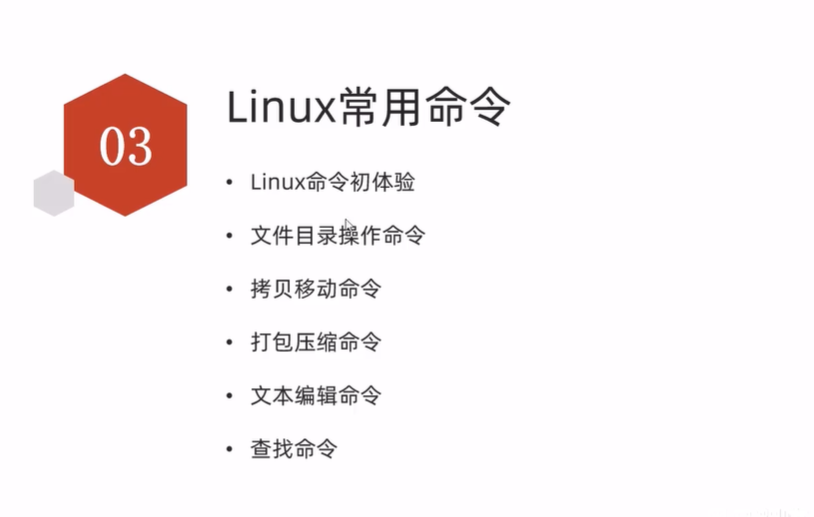

## 3.1 Linux命令

### (1）常用的命令

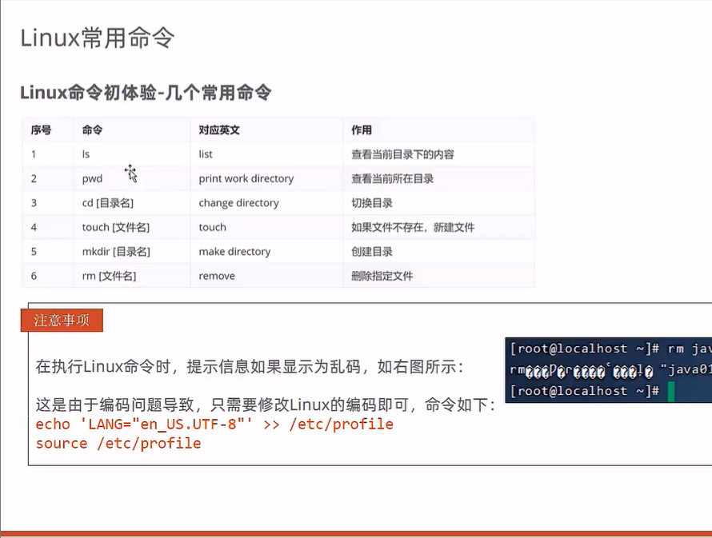


### (2) 命令格式

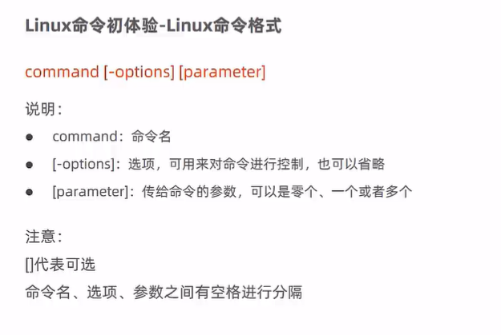

### （3）ls [-a] [dir] =  ll

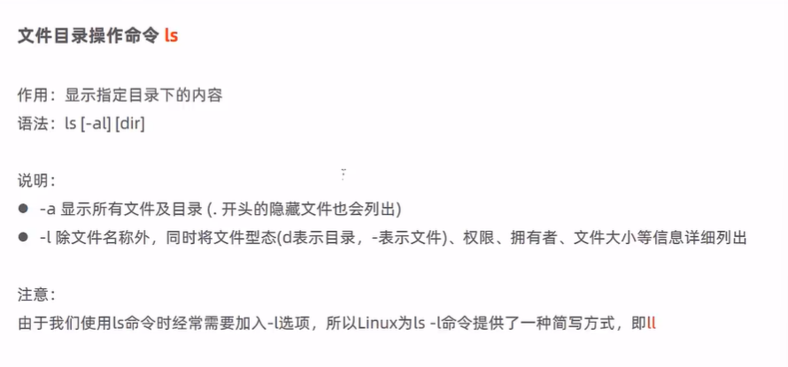

### (4) cd

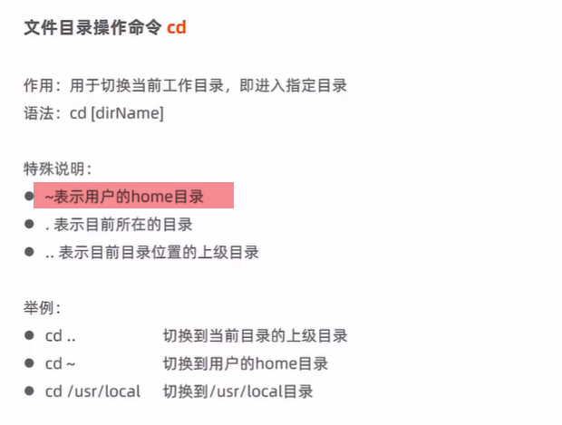

### (5) cat

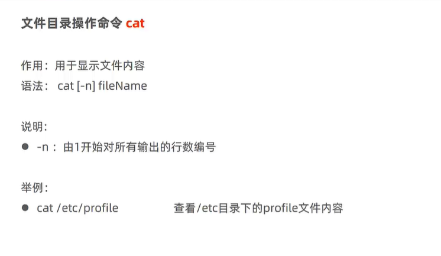

### （6） more——分页

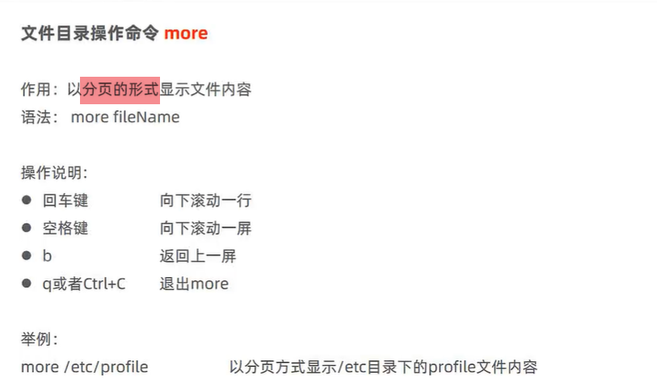


### (7) tail——文件末尾内容

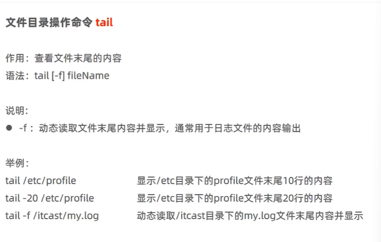


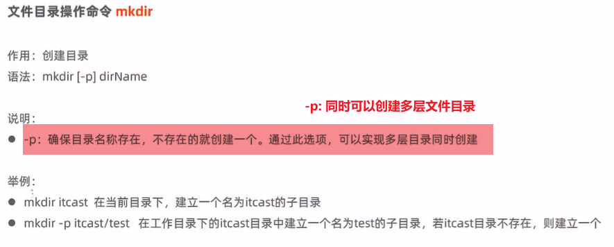


## 3.2 文件目录操作命令


5